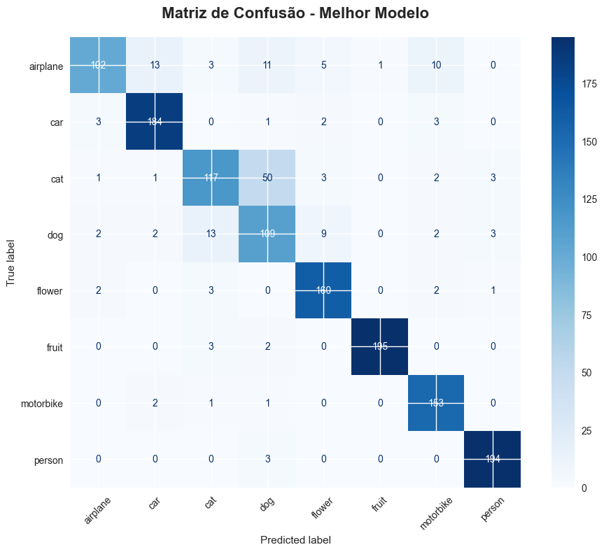

# Natural Images Classification - CNN

Este projeto consiste no desenvolvimento de uma **Rede Neural Convolucional (CNN)** para classificar imagens automaticamente em 8 categorias distintas. O modelo foi construído utilizando **Python** e a biblioteca **TensorFlow/Keras**, aplicando técnicas de *Deep Learning* para reconhecimento de padrões visuais.

 

## Autores
Desenvolvido por **Eduardo Graf** e **Nathan Wagner**

## Objetivo
Criar um classificador robusto capaz de identificar corretamente imagens pertencentes às classes:
* Airplane (Avião)
* Car (Carro)
* Cat (Gato)
* Dog (Cachorro)
* Flower (Flor)
* Fruit (Fruta)
* Motorbike (Moto)
* Person (Pessoa)

## Tecnologias Utilizadas
* **Linguagem:** Python
* **Deep Learning:** TensorFlow & Keras
* **Manipulação de Dados:** NumPy
* **Visualização:** Matplotlib & Seaborn
* **Métricas:** Scikit-learn (Classification Report, Confusion Matrix)

## Arquitetura do Modelo
O modelo segue uma arquitetura sequencial profunda otimizada para extração de características:

1.  **Entrada:** Imagens redimensionadas para $150 \times 150$ pixels.
2.  **Extração de Features:** 4 blocos de camadas `Conv2D` (32, 64, 128, 256 filtros) intercaladas com `MaxPooling2D` e `BatchNormalization`.
3.  **Classificação:** Camadas `Dense` com regularização via `Dropout` (para evitar *overfitting*) e camada de saída com ativação `Softmax` (8 neurônios).

### Pré-processamento e Data Augmentation
Para melhorar a generalização do modelo e evitar que ele apenas "decore" os dados de treino, foi utilizado o `ImageDataGenerator` com transformações dinâmicas:
* Rotação e Zoom
* Espelhamento Horizontal (Flip)
* Ajustes de Brilho
* Normalização de pixels (escala 0-1)

### Estratégia de Treinamento (Callbacks)
O treinamento foi supervisionado por funções de controle:
* **EarlyStopping:** Interrompe o treino se o modelo parar de evoluir, economizando tempo.
* **ModelCheckpoint:** Salva apenas a melhor versão do modelo (maior acurácia de validação).
* **ReduceLROnPlateau:** Reduz a taxa de aprendizado se o erro estagnar, permitindo um ajuste fino dos pesos.

## Resultados
O modelo foi avaliado utilizando um conjunto de validação separado (20% dos dados).

* **Acurácia Final:** [88.53%]

Abaixo, um exemplo da performance visualizada através da Matriz de Confusão:
